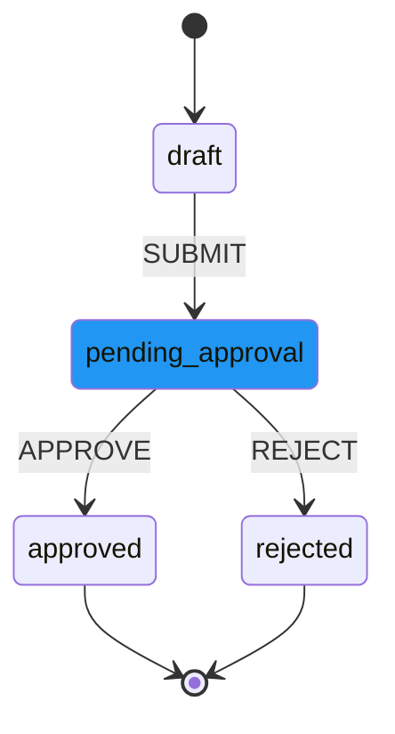

# XState Workflow Manual

A comprehensive guide to setting up and using XState Workflow for Frappe Framework.

---

## Table of Contents

- [Part 1: Getting Started](#part-1-getting-started)
  - [1.1 Introduction](#11-introduction)
  - [1.2 Prerequisites](#12-prerequisites)
  - [1.3 Installation](#13-installation)
  - [1.4 Quick Start](#14-quick-start)
- [Part 2: Workflow Builder Guide](#part-2-workflow-builder-guide)
  - [2.1 Accessing the Builder](#21-accessing-the-builder)
  - [2.2 Node Types](#22-node-types)
  - [2.3 Transitions & Edges](#23-transitions--edges)
  - [2.4 Properties Panel](#24-properties-panel)
  - [2.5 Saving & Loading Workflows](#25-saving--loading-workflows)
- [Part 3: Core Concepts](#part-3-core-concepts)
  - [3.1 State Machine Fundamentals](#31-state-machine-fundamentals)
  - [3.2 Guards (Conditions)](#32-guards-conditions)
  - [3.3 Actions](#33-actions)
  - [3.4 Assignment Resolvers](#34-assignment-resolvers)
- [Part 4: Approval System](#part-4-approval-system)
  - [4.1 Approval Tasks](#41-approval-tasks)
  - [4.2 User Actions](#42-user-actions)
  - [4.3 My Approvals Dashboard](#43-my-approvals-dashboard)
  - [4.4 Delegation](#44-delegation)
- [Part 5: Integration Guide](#part-5-integration-guide)
  - [5.1 Attaching Workflows to DocTypes](#51-attaching-workflows-to-doctypes)
  - [5.2 Document Event Hooks](#52-document-event-hooks)
  - [5.3 JavaScript API](#53-javascript-api)
  - [5.4 Python API](#54-python-api)
  - [5.5 Form Widget](#55-form-widget)
- [Part 6: Advanced Features](#part-6-advanced-features)
  - [6.1 Parallel States](#61-parallel-states)
  - [6.2 History States](#62-history-states)
  - [6.3 Delayed Transitions](#63-delayed-transitions)
  - [6.4 Auto-Submission](#64-auto-submission)
  - [6.5 Multi-Tenant Support](#65-multi-tenant-support)
- [Part 7: Administration](#part-7-administration)
  - [7.1 Permissions & Roles](#71-permissions--roles)
  - [7.2 Monitoring & Debugging](#72-monitoring--debugging)
  - [7.3 Scheduled Jobs](#73-scheduled-jobs)
- [Part 8: Examples & Recipes](#part-8-examples--recipes)
  - [8.1 Simple Approval Workflow](#81-simple-approval-workflow)
  - [8.2 Multi-Level Approval](#82-multi-level-approval)
  - [8.3 Parallel Review Process](#83-parallel-review-process)
  - [8.4 Conditional Routing](#84-conditional-routing)
- [Part 9: End User Quick Reference](#part-9-end-user-quick-reference)
  - [9.1 Receiving Approval Tasks](#91-receiving-approval-tasks)
  - [9.2 Processing Tasks](#92-processing-tasks)
  - [9.3 Task Status Guide](#93-task-status-guide)
  - [9.4 Common Actions](#94-common-actions)
  - [9.5 Keyboard Navigation](#95-keyboard-navigation)
  - [9.6 Delegation](#96-delegation-out-of-office)
- [Appendix](#appendix)
  - [A. Troubleshooting](#a-troubleshooting)
  - [B. API Reference](#b-api-reference)
  - [C. Configuration Reference](#c-configuration-reference)

---

# Part 1: Getting Started

## 1.1 Introduction

### What is XState Workflow?

XState Workflow is a powerful state machine-based workflow engine for Frappe Framework. It enables you to design, build, and execute complex business workflows with a visual drag-and-drop interface.

```
┌─────────────────────────────────────────────────────────────────┐
│                    XState Workflow Architecture                  │
├─────────────────────────────────────────────────────────────────┤
│                                                                  │
│  ┌──────────────┐    ┌──────────────┐    ┌──────────────────┐  │
│  │   Workflow   │    │   Machine    │    │    Approval      │  │
│  │   Builder    │───▶│   Instance   │───▶│     Tasks        │  │
│  │   (React)    │    │   (State)    │    │   (Actions)      │  │
│  └──────────────┘    └──────────────┘    └──────────────────┘  │
│         │                   │                     │             │
│         ▼                   ▼                     ▼             │
│  ┌──────────────────────────────────────────────────────────┐  │
│  │                  Frappe Framework                         │  │
│  │    DocTypes  │  Permissions  │  Events  │  Scheduler      │  │
│  └──────────────────────────────────────────────────────────┘  │
│                                                                  │
└─────────────────────────────────────────────────────────────────┘
```

### Key Features

| Feature | Description |
|---------|-------------|
| **Visual Builder** | Drag-and-drop workflow designer with React Flow |
| **XState Engine** | Industry-standard state machine execution |
| **Approval System** | Built-in task assignment, claiming, escalation |
| **DocType Integration** | Attach workflows to any Frappe document type |
| **Real-time Updates** | Live state changes via WebSocket |
| **Flexible Guards** | Field-based, role-based, or Python conditions |
| **Custom Actions** | Execute Python code on state transitions |
| **Assignment Resolvers** | Multiple strategies for task assignment |

### Use Cases

- **Document Approvals**: Purchase orders, leave requests, expense claims
- **Multi-step Processes**: Onboarding, order fulfillment, support tickets
- **Conditional Routing**: Route documents based on amount, type, or other criteria
- **Parallel Processing**: Multiple reviewers working simultaneously
- **Escalation Workflows**: Auto-escalate overdue tasks

---

## 1.2 Prerequisites

Before installing XState Workflow, ensure you have:

| Requirement | Version | Notes |
|-------------|---------|-------|
| Frappe Framework | 14.0+ | ERPNext optional |
| Python | 3.10+ | Required for type hints |
| Node.js | 18+ | For frontend build |
| pnpm | 8+ | Package manager |
| MariaDB | 10.6+ | Database |

---

## 1.3 Installation

### Step 1: Get the App

```bash
# Navigate to your bench directory
cd ~/frappe-bench

# Get the app from repository
bench get-app https://github.com/your-org/xstate_workflow.git
```

### Step 2: Install on Site

```bash
# Install the app on your site
bench --site your-site.local install-app xstate_workflow
```

### Step 3: Build Frontend Assets

```bash
# Navigate to frontend directory
cd apps/xstate_workflow/frontend

# Install dependencies
pnpm install

# Build all packages
pnpm build
```

### Step 4: Clear Cache and Restart

```bash
# Clear Frappe cache
bench --site your-site.local clear-cache

# Restart the bench
bench restart
```

### Step 5: Verify Installation

1. Log into your Frappe site
2. Navigate to `/xstate-builder` in your browser
3. You should see the workflow builder interface

```
┌─────────────────────────────────────────────────────────────────┐
│  Verification Checklist                                          │
├─────────────────────────────────────────────────────────────────┤
│                                                                  │
│  [✓] App installed: bench --site [site] list-apps              │
│  [✓] Frontend built: Check for dist/ folders in frontend/      │
│  [✓] Builder accessible: Visit /xstate-builder                 │
│  [✓] DocTypes created: Check Desk > State Machine              │
│                                                                  │
└─────────────────────────────────────────────────────────────────┘
```

---

## 1.4 Quick Start

Let's create a simple approval workflow for a Contact DocType.

### Step 1: Open the Workflow Builder

Navigate to `/xstate-builder` in your browser.

### Step 2: Create the Workflow Structure

```
┌─────────────────────────────────────────────────────────────────┐
│  QUICK START: Simple Approval Workflow                           │
├─────────────────────────────────────────────────────────────────┤
│                                                                  │
│                         ○ Start                                  │
│                            │                                     │
│                            ▼                                     │
│                     ┌───────────┐                                │
│                     │   Draft   │                                │
│                     └─────┬─────┘                                │
│                           │ SUBMIT                               │
│                           ▼                                      │
│                  ┌─────────────────┐                             │
│                  │ ◇ Pending       │                             │
│                  │   Approval      │                             │
│                  └────────┬────────┘                             │
│                     ┌─────┴─────┐                                │
│                     │           │                                │
│              APPROVE│           │REJECT                          │
│                     ▼           ▼                                │
│              ┌──────────┐ ┌──────────┐                           │
│              │ Approved │ │ Rejected │                           │
│              │    ◎     │ │    ◎     │                           │
│              └──────────┘ └──────────┘                           │
│                                                                  │
└─────────────────────────────────────────────────────────────────┘
```

### Step 3: Add Nodes

1. Drag a **Start** node onto the canvas
2. Add an **Atomic State** node, label it "Draft"
3. Add an **Approval** node, label it "Pending Approval"
4. Add two **End** nodes: "Approved" and "Rejected"

### Step 4: Connect with Transitions

1. Connect Start → Draft (automatic)
2. Connect Draft → Pending Approval (event: `SUBMIT`)
3. Connect Pending Approval → Approved (event: `APPROVE`)
4. Connect Pending Approval → Rejected (event: `REJECT`)

### Step 5: Configure the Approval Node

1. Select the "Pending Approval" node
2. In Properties Panel, set:
   - **Assignment Type**: Role
   - **Role**: Sales Manager
   - **Available Actions**: Approve, Reject

### Step 6: Save the Workflow

1. Click the **Save** button
2. Enter details:
   - **Machine ID**: `contact_approval`
   - **Title**: Contact Approval Workflow
   - **Attached DocType**: Contact
   - **Auto-start on Create**: Yes

### Step 7: Test the Workflow

1. Create a new Contact document
2. The workflow starts automatically in "Draft" state
3. Click "Submit" action button
4. Log in as a Sales Manager
5. Find the approval task and approve it

---

# Part 2: Workflow Builder Guide

## 2.1 Accessing the Builder

### URL Routes

| URL | Purpose |
|-----|---------|
| `/xstate-builder` | Create new workflow (V1) |
| `/xstate-builder/<machine_id>` | Edit existing workflow (V1) |
| `/xstate-builder-v2` | Create new workflow (V2 enhanced) |
| `/xstate-builder-v2/<machine_id>` | Edit existing workflow (V2) |

### Builder Interface Overview

```
┌─────────────────────────────────────────────────────────────────┐
│  XState Workflow Builder                              [Save] [▼] │
├─────────┬───────────────────────────────────────┬───────────────┤
│         │                                       │               │
│  NODES  │         CANVAS AREA                   │  PROPERTIES   │
│  PANEL  │                                       │    PANEL      │
│  ─────  │    ┌───────┐                          │  ──────────   │
│         │    │ Start │                          │               │
│ ○ Start │    └───┬───┘                          │  Node: draft  │
│         │        │                              │               │
│ □ State │        ▼                              │  Label:       │
│         │    ┌───────┐      ┌───────┐          │  [Draft    ]  │
│ ◇ Aprv  │    │ Draft │─────▶│Pending│          │               │
│         │    └───────┘      └───────┘          │  On Entry:    │
│ ◆ Auto  │                       │               │  [None     ▼] │
│         │                       ▼               │               │
│ ═ Parll │                   ┌───────┐          │  Transitions: │
│         │                   │Approve│          │  ┌──────────┐ │
│ ◎ End   │                   └───────┘          │  │+ Add     │ │
│         │                                       │  └──────────┘ │
│ ⟲ Hist  │                                       │               │
│         │                                       │               │
└─────────┴───────────────────────────────────────┴───────────────┘
     │                    │                              │
     │                    │                              │
     ▼                    ▼                              ▼
  Drag nodes         Design your              Configure selected
  to canvas          workflow here            node/edge properties
```

### V2 Builder Enhancements

The V2 builder (`/xstate-builder-v2`) includes additional features:

| Feature | Description |
|---------|-------------|
| **Undo/Redo** | Ctrl+Z / Ctrl+Shift+Z to undo/redo changes |
| **Copy/Paste** | Ctrl+C / Ctrl+V to duplicate nodes and edges |
| **Helper Lines** | Alignment guides when positioning nodes |
| **Workflow Selector** | Dropdown to load existing workflows |

### Keyboard Shortcuts

| Shortcut | Action |
|----------|--------|
| `Ctrl+Z` | Undo last action |
| `Ctrl+Shift+Z` | Redo last undone action |
| `Ctrl+C` | Copy selected nodes/edges |
| `Ctrl+V` | Paste copied nodes/edges |
| `Delete` / `Backspace` | Delete selected elements |
| `Ctrl+A` | Select all nodes |
| `Escape` | Deselect all |

### Resizable Panels

Both the Node Palette (left) and Properties Panel (right) are resizable:

- **Drag** the panel edge to resize
- **Double-click** the edge to collapse/expand
- **Minimum/Maximum widths**:
  - Node Palette: 150px - 350px
  - Properties Panel: 280px - 500px

---

## 2.2 Node Types

```
┌─────────────────────────────────────────────────────────────────┐
│                         NODE TYPES                               │
├─────────────────────────────────────────────────────────────────┤
│                                                                  │
│  ○ START NODE              Entry point of workflow              │
│  ────────────                                                    │
│      ○──▶                  Every workflow needs exactly one     │
│                                                                  │
│  □ ATOMIC STATE            Simple state with no children        │
│  ─────────────                                                   │
│    ┌─────────┐             Basic workflow step                  │
│    │  State  │             Can have entry/exit actions          │
│    └─────────┘                                                   │
│                                                                  │
│  ▣ COMPOUND STATE          State containing nested states       │
│  ───────────────                                                 │
│    ┌─────────────────┐     Groups related states together       │
│    │ Parent          │     Has its own initial state            │
│    │  ┌─────┐┌─────┐ │                                          │
│    │  │ A   ││ B   │ │                                          │
│    │  └─────┘└─────┘ │                                          │
│    └─────────────────┘                                          │
│                                                                  │
│  ═ PARALLEL STATE          Concurrent execution regions         │
│  ───────────────                                                 │
│    ╔═════════════════╗     Multiple states active at once       │
│    ║ Region1║Region2 ║     All regions must complete            │
│    ║ ┌───┐  ║ ┌───┐  ║                                          │
│    ║ │ A │  ║ │ X │  ║                                          │
│    ║ └───┘  ║ └───┘  ║                                          │
│    ╚═════════════════╝                                          │
│                                                                  │
│  ◇ APPROVAL NODE           Creates approval task                │
│  ──────────────                                                  │
│    ┌─────────────┐         Assigns to user or role              │
│    │ ◇ Approval  │         Waits for human action               │
│    │   [Actions] │         Configurable action buttons          │
│    └─────────────┘                                               │
│                                                                  │
│  ◇◇ PARALLEL APPROVAL      Multi-approver workflow              │
│  ─────────────────                                               │
│    ┌─────────────┐         Multiple concurrent approvers        │
│    │ ◇◇ Parallel │         Configurable approval threshold      │
│    │   [2 of 3]  │         Required vs optional approvers       │
│    └─────────────┘                                               │
│                                                                  │
│  ◆ AUTO ACTION NODE        Automatic execution                  │
│  ─────────────────                                               │
│    ┌─────────────┐         Runs actions automatically           │
│    │ ◆ Auto      │         No human interaction needed          │
│    └─────────────┘         Good for API calls, updates          │
│                                                                  │
│  ⟲ HISTORY STATE           Remembers previous state             │
│  ─────────────                                                   │
│    ┌─────────────┐         Shallow: direct child only           │
│    │ ⟲ History   │         Deep: deepest nested state           │
│    └─────────────┘                                               │
│                                                                  │
│  ◎ END NODE                Terminal state                       │
│  ────────                                                        │
│      ──▶◎                  Marks workflow completion            │
│                            Can trigger auto-submit              │
│                                                                  │
└─────────────────────────────────────────────────────────────────┘
```

### Node Type Details

#### Start Node
- Every workflow must have exactly one Start node
- Automatically connects to the initial state
- Cannot have incoming transitions

#### Atomic State Node
- Basic building block for workflows
- Can have entry actions (run when entering)
- Can have exit actions (run when leaving)
- Transitions defined for outgoing events

#### Compound State Node
- Contains child states
- Must specify an initial child state
- Useful for grouping related states
- Parent can have transitions that apply to all children

#### Parallel State Node
- Contains multiple regions that execute simultaneously
- All regions must reach final states to complete
- Useful for parallel reviews or concurrent processes

#### Approval Node
- Special node that creates an Approval Task
- Configurable assignment (user, role, resolver)
- Defines available actions (Approve, Reject, etc.)
- Workflow waits until task is completed

#### Parallel Approval Node
- Creates multiple approval tasks simultaneously
- Configure multiple approvers (each with their own resolver)
- Set approval threshold (e.g., "2 of 3 must approve")
- Mark approvers as required or optional
- Ideal for: dual-signature requirements, committee decisions, multi-department sign-offs

**Example Use Cases:**
- Finance AND Manager must both approve purchases over $10,000
- Any 2 of 3 department heads must approve budget changes
- Legal review required, but marketing review is optional

#### Auto Action Node
- Executes actions automatically on entry
- Immediately transitions to next state
- Good for: API calls, field updates, notifications

#### History State Node
- Remembers which state was active when exiting parent
- **Shallow**: Remembers direct child state
- **Deep**: Remembers deepest nested state

#### End Node
- Marks workflow completion
- Optional auto-submit for documents
- No outgoing transitions allowed

---

## 2.3 Transitions & Edges

### Creating Transitions

1. Hover over source node to see connection handles
2. Drag from handle to target node
3. Release to create transition
4. Click transition to configure

```
┌─────────────────────────────────────────────────────────────────┐
│                    TRANSITION ANATOMY                            │
├─────────────────────────────────────────────────────────────────┤
│                                                                  │
│    ┌─────────┐                      ┌─────────┐                 │
│    │  Draft  │───── SUBMIT ────────▶│ Review  │                 │
│    └─────────┘        │             └─────────┘                 │
│                       │                                          │
│                       ├── Event name (trigger)                  │
│                       ├── Guard (optional condition)            │
│                       └── Actions (optional side effects)       │
│                                                                  │
│    Example with guard:                                          │
│                                                                  │
│    ┌─────────┐   APPROVE              ┌─────────┐              │
│    │ Review  │───[amount>10000]──────▶│ Director│              │
│    └─────────┘                        └─────────┘              │
│                                                                  │
│    Example with action:                                         │
│                                                                  │
│    ┌─────────┐   COMPLETE             ┌─────────┐              │
│    │ Process │───/sendEmail──────────▶│  Done   │              │
│    └─────────┘                        └─────────┘              │
│                                                                  │
└─────────────────────────────────────────────────────────────────┘
```

### Event Naming Conventions

| Convention | Example | Usage |
|------------|---------|-------|
| UPPER_CASE | `SUBMIT`, `APPROVE` | User-triggered actions |
| snake_case | `auto_transition` | System-triggered events |
| dot.notation | `approval.complete` | Namespaced events |

### Transition Types

| Type | Description | Example |
|------|-------------|---------|
| **Event** | Triggered by named event | `on: { SUBMIT: 'review' }` |
| **Always** | Automatic with optional guard | `always: { target: 'next' }` |
| **Delayed** | After time period | `after: { 24h: 'escalated' }` |

---

## 2.4 Properties Panel

The Properties Panel appears on the right side when you select a node or edge.

### Node Properties

```
┌─────────────────────────────────────────┐
│  NODE PROPERTIES                        │
├─────────────────────────────────────────┤
│                                         │
│  ID:     [pending_approval          ]   │
│  Label:  [Pending Approval          ]   │
│                                         │
│  ─── Entry Actions ───                  │
│  ┌─────────────────────────────────┐   │
│  │ create_approval_task            │   │
│  │ [+ Add Action]                  │   │
│  └─────────────────────────────────┘   │
│                                         │
│  ─── Exit Actions ───                   │
│  ┌─────────────────────────────────┐   │
│  │ [+ Add Action]                  │   │
│  └─────────────────────────────────┘   │
│                                         │
│  ─── Approval Settings ───              │
│  (for Approval nodes only)              │
│                                         │
│  Assignment Type: [Role           ▼]   │
│  Role:           [Sales Manager   ▼]   │
│                                         │
│  Available Actions:                     │
│  [✓] Approve                            │
│  [✓] Reject                             │
│  [ ] Request Info                       │
│  [+ Custom Action]                      │
│                                         │
└─────────────────────────────────────────┘
```

### Edge (Transition) Properties

```
┌─────────────────────────────────────────┐
│  TRANSITION PROPERTIES                  │
├─────────────────────────────────────────┤
│                                         │
│  Event:  [APPROVE                   ]   │
│                                         │
│  ─── Guard Condition ───                │
│                                         │
│  Type: [Simple               ▼]        │
│                                         │
│  Field:    [grand_total         ]      │
│  Operator: [greater than      ▼]       │
│  Value:    [10000               ]      │
│                                         │
│  ─── Transition Actions ───             │
│  ┌─────────────────────────────────┐   │
│  │ log_approval                    │   │
│  │ [+ Add Action]                  │   │
│  └─────────────────────────────────┘   │
│                                         │
└─────────────────────────────────────────┘
```

---

## 2.5 Saving & Loading Workflows

### Saving a Workflow

1. Click the **Save** button in the toolbar
2. Fill in the save dialog:

```
┌─────────────────────────────────────────┐
│  SAVE WORKFLOW                          │
├─────────────────────────────────────────┤
│                                         │
│  Machine ID:    [purchase_approval  ]   │
│  (unique identifier, no spaces)         │
│                                         │
│  Title:         [Purchase Approval  ]   │
│  (human-readable name)                  │
│                                         │
│  Description:                           │
│  [Multi-level approval for purchases]   │
│                                         │
│  Attached DocType: [Purchase Order ▼]  │
│                                         │
│  [✓] Active                             │
│  [✓] Auto-start on Create               │
│                                         │
│  Edit Restriction:                      │
│  [Assigned Only                    ▼]  │
│                                         │
│        [Cancel]  [Save]                 │
│                                         │
└─────────────────────────────────────────┘
```

### Loading an Existing Workflow

**Method 1: Direct URL**
```
/xstate-builder/purchase_approval
```

**Method 2: V2 Workflow Selector**
1. Open `/xstate-builder-v2`
2. Use the dropdown in the toolbar
3. Select workflow to load

### Export/Import

**Export:**
1. Open workflow in builder
2. Click menu → Export
3. JSON file downloads

**Import:**
1. Click menu → Import
2. Select JSON file
3. Workflow loads in builder

---

# Part 3: Core Concepts

## 3.1 State Machine Fundamentals

### States and Transitions

A state machine consists of:
- **States**: The possible conditions of your workflow
- **Transitions**: Rules for moving between states
- **Events**: Triggers that cause transitions
- **Context**: Data that persists across states

```
┌─────────────────────────────────────────────────────────────────┐
│                    STATE MACHINE FLOW                            │
├─────────────────────────────────────────────────────────────────┤
│                                                                  │
│   Document Created                                               │
│         │                                                        │
│         ▼                                                        │
│   ┌───────────┐                                                  │
│   │  Check    │──No──▶ Normal Frappe flow                       │
│   │ Workflow? │                                                  │
│   └─────┬─────┘                                                  │
│         │ Yes                                                    │
│         ▼                                                        │
│   ┌───────────────┐                                              │
│   │    Create     │                                              │
│   │   Instance    │                                              │
│   └───────┬───────┘                                              │
│           │                                                      │
│           ▼                                                      │
│   ┌───────────────┐     ┌──────────────┐                        │
│   │ Initial State │────▶│ Event Occurs │◀─────────┐             │
│   └───────────────┘     └──────┬───────┘          │             │
│                                │                   │             │
│                                ▼                   │             │
│                        ┌───────────────┐          │             │
│                        │ Check Guards  │          │             │
│                        └───────┬───────┘          │             │
│                                │                   │             │
│                    ┌───────────┴───────────┐      │             │
│                    ▼                       ▼      │             │
│              ┌──────────┐           ┌──────────┐  │             │
│              │  Guard   │           │  Guard   │  │             │
│              │  Passes  │           │  Fails   │  │             │
│              └────┬─────┘           └──────────┘  │             │
│                   │                               │             │
│                   ▼                               │             │
│           ┌───────────────┐                       │             │
│           │Execute Actions│                       │             │
│           └───────┬───────┘                       │             │
│                   │                               │             │
│                   ▼                               │             │
│           ┌───────────────┐                       │             │
│           │  Transition   │───────────────────────┘             │
│           │  to New State │                                     │
│           └───────┬───────┘                                     │
│                   │                                              │
│                   ▼                                              │
│           ┌───────────────┐                                      │
│           │  Final State? │──Yes──▶ Workflow Complete           │
│           └───────────────┘                                      │
│                                                                  │
└─────────────────────────────────────────────────────────────────┘
```

### Initial and Final States

**Initial State:**
- First state entered when workflow starts
- Defined on compound/parallel states
- Start node connects to initial state

**Final State:**
- Marks completion of workflow or compound state
- Can trigger auto-submit for documents
- No outgoing transitions allowed

### Context (Workflow Variables)

Context stores data that persists across states:

```python
# Initial context defined in workflow
{
  "context": {
    "approval_count": 0,
    "approvers": [],
    "last_action": null
  }
}
```

Update context in actions:
```python
# In an action
context['approval_count'] += 1
context['approvers'].append(frappe.session.user)
```

---

## 3.2 Guards (Conditions)

Guards are conditions that must be true for a transition to occur.

### Simple Guards

Field-based comparisons:

```json
{
  "type": "simple",
  "field": "grand_total",
  "operator": "gt",
  "value": 10000
}
```

**Available Operators:**

| Operator | Description | Example |
|----------|-------------|---------|
| `eq` | Equals | `status eq "Draft"` |
| `ne` | Not equals | `priority ne "Low"` |
| `gt` | Greater than | `amount gt 1000` |
| `lt` | Less than | `quantity lt 5` |
| `gte` | Greater or equal | `score gte 80` |
| `lte` | Less or equal | `age lte 65` |
| `in` | In list | `type in ["A","B"]` |
| `contains` | String contains | `name contains "Test"` |
| `is_set` | Field has value | `approver is_set` |
| `is_not_set` | Field is empty | `rejection_reason is_not_set` |

### Compound Guards

Combine multiple conditions:

```json
{
  "type": "compound",
  "operator": "and",
  "conditions": [
    {
      "type": "simple",
      "field": "amount",
      "operator": "gt",
      "value": 10000
    },
    {
      "type": "simple",
      "field": "category",
      "operator": "eq",
      "value": "Equipment"
    }
  ]
}
```

**Compound Operators:**
- `and` - All conditions must be true
- `or` - At least one condition must be true

### Role Guards

Check if user has a specific role:

```json
{
  "type": "role",
  "roles": ["Purchase Manager", "Director"]
}
```

### Python Guards

Custom Python code for complex conditions:

```python
# Defined in Guards child table of State Machine
# Guard name: high_value_purchase

# Available variables: context, event, doc, frappe
doc.grand_total > 10000 and doc.category == "Equipment"
```

Use in workflow:
```json
{
  "on": {
    "APPROVE": {
      "target": "director_approval",
      "cond": "high_value_purchase"
    }
  }
}
```

---

## 3.2.1 Writing Conditions - Complete Guide

This section provides detailed guidance on writing guard conditions for routing
workflow transitions.

### Understanding Conditional Routing

```
┌─────────────────────────────────────────────────────────────────┐
│                 CONDITIONAL ROUTING FLOW                         │
├─────────────────────────────────────────────────────────────────┤
│                                                                  │
│                    ┌─────────────────┐                          │
│                    │  Current State  │                          │
│                    └────────┬────────┘                          │
│                             │                                    │
│                             │ EVENT triggered                    │
│                             ▼                                    │
│                    ┌─────────────────┐                          │
│                    │ Evaluate Guards │                          │
│                    │  (conditions)   │                          │
│                    └────────┬────────┘                          │
│                             │                                    │
│           ┌─────────────────┼─────────────────┐                 │
│           │                 │                 │                  │
│           ▼                 ▼                 ▼                  │
│    ┌────────────┐    ┌────────────┐    ┌────────────┐          │
│    │ Guard 1    │    │ Guard 2    │    │ No Guard   │          │
│    │ amount>10k │    │ amount>50k │    │ (default)  │          │
│    └─────┬──────┘    └─────┬──────┘    └─────┬──────┘          │
│          │                 │                 │                   │
│          ▼                 ▼                 ▼                   │
│    ┌──────────┐      ┌──────────┐      ┌──────────┐            │
│    │ Manager  │      │ Director │      │ Auto     │            │
│    │ Approval │      │ Approval │      │ Approve  │            │
│    └──────────┘      └──────────┘      └──────────┘            │
│                                                                  │
│   Guards are evaluated in ORDER - first match wins!            │
│                                                                  │
└─────────────────────────────────────────────────────────────────┘
```

### Configuring Conditions in the Builder

When you select a transition edge in the workflow builder, the Properties Panel
shows condition configuration:

```
┌─────────────────────────────────────────┐
│  TRANSITION: Draft → Review             │
├─────────────────────────────────────────┤
│                                         │
│  Event Name: [SUBMIT              ]     │
│                                         │
│  ─── Condition (Guard) ───              │
│                                         │
│  Condition Type:                        │
│  ┌─────────────────────────────────┐   │
│  │ ○ No Condition (always pass)    │   │
│  │ ● Simple (single field check)   │   │
│  │ ○ Compound (multiple conditions)│   │
│  │ ○ Role-based (user role check)  │   │
│  │ ○ Python (custom code)          │   │
│  └─────────────────────────────────┘   │
│                                         │
│  ─── Simple Condition ───               │
│                                         │
│  Field:    [grand_total          ▼]    │
│  Operator: [is greater than      ▼]    │
│  Value:    [10000                 ]    │
│                                         │
│  Preview: grand_total > 10000           │
│                                         │
└─────────────────────────────────────────┘
```

### Simple Conditions - Field Comparisons

Simple conditions compare a document field against a value.

#### Syntax

```json
{
  "type": "simple",
  "field": "<field_name>",
  "operator": "<operator>",
  "value": "<comparison_value>"
}
```

#### Operators Reference

```
┌─────────────────────────────────────────────────────────────────┐
│                    COMPARISON OPERATORS                          │
├─────────────────────────────────────────────────────────────────┤
│                                                                  │
│  EQUALITY                                                        │
│  ─────────                                                       │
│  eq     │ Equals              │ status eq "Draft"               │
│  ne     │ Not equals          │ priority ne "Low"               │
│                                                                  │
│  NUMERIC                                                         │
│  ───────                                                         │
│  gt     │ Greater than        │ amount gt 1000                  │
│  lt     │ Less than           │ quantity lt 10                  │
│  gte    │ Greater or equal    │ score gte 80                    │
│  lte    │ Less or equal       │ age lte 65                      │
│                                                                  │
│  MEMBERSHIP                                                      │
│  ──────────                                                      │
│  in     │ Value in list       │ status in ["A","B","C"]         │
│  contains│ String contains    │ name contains "Test"            │
│                                                                  │
│  EXISTENCE                                                       │
│  ─────────                                                       │
│  is_set    │ Field has value  │ approver is_set                 │
│  is_not_set│ Field is empty   │ rejection_reason is_not_set     │
│                                                                  │
└─────────────────────────────────────────────────────────────────┘
```

#### Examples

**Check if amount exceeds threshold:**
```json
{
  "type": "simple",
  "field": "grand_total",
  "operator": "gt",
  "value": 10000
}
```

**Check document status:**
```json
{
  "type": "simple",
  "field": "status",
  "operator": "eq",
  "value": "Pending"
}
```

**Check if field is in a list:**
```json
{
  "type": "simple",
  "field": "category",
  "operator": "in",
  "value": ["Electronics", "Furniture", "Equipment"]
}
```

**Check linked document field (dot notation):**
```json
{
  "type": "simple",
  "field": "customer.customer_group",
  "operator": "eq",
  "value": "VIP"
}
```

**Check if approver is assigned:**
```json
{
  "type": "simple",
  "field": "custom_approver",
  "operator": "is_set"
}
```

### Compound Conditions - Multiple Checks

Combine multiple conditions with AND/OR logic.

```
┌─────────────────────────────────────────────────────────────────┐
│                    COMPOUND CONDITIONS                           │
├─────────────────────────────────────────────────────────────────┤
│                                                                  │
│  AND Logic (all must be true)                                   │
│  ────────────────────────────                                    │
│                                                                  │
│     amount > 10000                                               │
│          AND                                                     │
│     category = "Equipment"        ───▶  Director Approval       │
│          AND                                                     │
│     is_urgent = true                                            │
│                                                                  │
│                                                                  │
│  OR Logic (any one is enough)                                   │
│  ────────────────────────────                                    │
│                                                                  │
│     user_role = "Director"                                       │
│          OR                        ───▶  Skip Approval          │
│     amount < 100                                                │
│          OR                                                      │
│     is_preapproved = true                                       │
│                                                                  │
└─────────────────────────────────────────────────────────────────┘
```

#### AND Condition

All sub-conditions must be true:

```json
{
  "type": "compound",
  "operator": "and",
  "conditions": [
    {
      "type": "simple",
      "field": "grand_total",
      "operator": "gt",
      "value": 10000
    },
    {
      "type": "simple",
      "field": "category",
      "operator": "eq",
      "value": "Equipment"
    },
    {
      "type": "simple",
      "field": "is_urgent",
      "operator": "eq",
      "value": true
    }
  ]
}
```

#### OR Condition

At least one sub-condition must be true:

```json
{
  "type": "compound",
  "operator": "or",
  "conditions": [
    {
      "type": "simple",
      "field": "grand_total",
      "operator": "lt",
      "value": 1000
    },
    {
      "type": "simple",
      "field": "is_preapproved",
      "operator": "eq",
      "value": true
    }
  ]
}
```

#### Nested Compound Conditions

Combine AND and OR for complex logic:

```
┌─────────────────────────────────────────────────────────────────┐
│  Complex Condition Example                                       │
├─────────────────────────────────────────────────────────────────┤
│                                                                  │
│  Route to Director if:                                          │
│                                                                  │
│     ( amount > 50000 )                                          │
│           OR                                                     │
│     ( amount > 10000 AND category = "Equipment" )               │
│           OR                                                     │
│     ( is_capital_expenditure = true )                           │
│                                                                  │
└─────────────────────────────────────────────────────────────────┘
```

```json
{
  "type": "compound",
  "operator": "or",
  "conditions": [
    {
      "type": "simple",
      "field": "grand_total",
      "operator": "gt",
      "value": 50000
    },
    {
      "type": "compound",
      "operator": "and",
      "conditions": [
        {
          "type": "simple",
          "field": "grand_total",
          "operator": "gt",
          "value": 10000
        },
        {
          "type": "simple",
          "field": "category",
          "operator": "eq",
          "value": "Equipment"
        }
      ]
    },
    {
      "type": "simple",
      "field": "is_capital_expenditure",
      "operator": "eq",
      "value": true
    }
  ]
}
```

### Role-Based Conditions

Check if the current user has specific roles:

```json
{
  "type": "role",
  "roles": ["Purchase Manager", "Director", "CEO"]
}
```

**Use case:** Allow certain users to bypass approval:

```
┌─────────────────────────────────────────────────────────────────┐
│                    ROLE-BASED ROUTING                            │
├─────────────────────────────────────────────────────────────────┤
│                                                                  │
│                    ┌───────────┐                                 │
│                    │   Draft   │                                 │
│                    └─────┬─────┘                                 │
│                          │ SUBMIT                                │
│                          ▼                                       │
│               ┌─────────────────────┐                           │
│               │   Check User Role   │                           │
│               └──────────┬──────────┘                           │
│                    ┌─────┴─────┐                                │
│                    │           │                                 │
│            [Director]     [Others]                              │
│                    │           │                                 │
│                    ▼           ▼                                 │
│             ┌──────────┐ ┌───────────────┐                      │
│             │ Approved │ │ Need Approval │                      │
│             │    ◎     │ │      ◇        │                      │
│             └──────────┘ └───────────────┘                      │
│                                                                  │
│   Directors skip approval, others go through normal flow       │
│                                                                  │
└─────────────────────────────────────────────────────────────────┘
```

### Python Code Conditions

For complex business logic that can't be expressed with simple/compound guards.

#### Creating Python Guards

1. Open the State Machine document
2. Go to the "Guards" child table
3. Add a new row:

```
┌─────────────────────────────────────────────────────────────────┐
│  STATE MACHINE: Purchase Approval                                │
├─────────────────────────────────────────────────────────────────┤
│                                                                  │
│  ─── Guards ───                                                  │
│                                                                  │
│  │ Guard Name          │ Description              │ Code       │
│  ├─────────────────────┼──────────────────────────┼────────────│
│  │ high_value_purchase │ Amount over 10k          │ [Edit]     │
│  │ needs_director      │ Requires director sign   │ [Edit]     │
│  │ budget_available    │ Check budget remaining   │ [Edit]     │
│  │ + Add Row           │                          │            │
│                                                                  │
└─────────────────────────────────────────────────────────────────┘
```

#### Available Variables in Python Guards

| Variable | Type | Description |
|----------|------|-------------|
| `doc` | Document | The Frappe document being processed |
| `context` | dict | Workflow context variables |
| `event` | dict | Event data passed to trigger |
| `frappe` | module | Frappe framework module |

#### Python Guard Examples

**Simple field check:**
```python
# Guard name: high_value_purchase
doc.grand_total > 10000
```

**Multiple conditions:**
```python
# Guard name: needs_director_approval
doc.grand_total > 10000 and doc.category == "Equipment"
```

**Check workflow context:**
```python
# Guard name: already_approved_by_manager
context.get('manager_approved') == True
```

**Date-based conditions:**
```python
# Guard name: is_end_of_quarter
from frappe.utils import getdate, today
current_date = getdate(today())
current_date.month in [3, 6, 9, 12] and current_date.day > 25
```

**Check linked documents:**
```python
# Guard name: customer_has_credit
customer = frappe.get_doc("Customer", doc.customer)
customer.credit_limit > doc.grand_total
```

**Check user permissions:**
```python
# Guard name: user_is_owner_manager
doc.owner == frappe.session.user or \
frappe.db.exists("Employee", {
    "user_id": frappe.session.user,
    "reports_to": frappe.db.get_value("Employee", {"user_id": doc.owner}, "name")
})
```

**Check approval history:**
```python
# Guard name: not_previously_rejected
not any(
    log.get('event') == 'REJECT'
    for log in context.get('transition_history', [])
)
```

**Complex business rule:**
```python
# Guard name: requires_finance_review
# Orders over 5k need finance, or any order with payment terms > 30 days

amount_threshold = doc.grand_total > 5000
extended_terms = doc.payment_terms_template and \
    frappe.db.get_value("Payment Terms Template",
                        doc.payment_terms_template,
                        "credit_days") > 30

amount_threshold or extended_terms
```

#### Using Python Guards in Transitions

Reference the guard by name in your workflow JSON:

```json
{
  "pending_approval": {
    "on": {
      "APPROVE": [
        {
          "target": "director_approval",
          "cond": "needs_director_approval"
        },
        {
          "target": "finance_review",
          "cond": "requires_finance_review"
        },
        {
          "target": "approved"
        }
      ]
    }
  }
}
```

### Multiple Transitions with Guards

When an event has multiple possible targets, guards determine which one:

```
┌─────────────────────────────────────────────────────────────────┐
│              MULTIPLE TRANSITION ROUTING                         │
├─────────────────────────────────────────────────────────────────┤
│                                                                  │
│  Event: APPROVE from "manager_review" state                     │
│                                                                  │
│  Transitions evaluated in order:                                │
│                                                                  │
│    1. ─── [amount > 50000] ────────────▶ ceo_approval           │
│           │                                                      │
│           │ (guard fails, try next)                             │
│           ▼                                                      │
│    2. ─── [amount > 10000] ────────────▶ director_approval      │
│           │                                                      │
│           │ (guard fails, try next)                             │
│           ▼                                                      │
│    3. ─── [no guard / default] ────────▶ approved               │
│                                                                  │
│  First matching guard wins!                                     │
│  Always put stricter conditions first.                          │
│                                                                  │
└─────────────────────────────────────────────────────────────────┘
```

**JSON Configuration:**

```json
{
  "manager_review": {
    "on": {
      "APPROVE": [
        {
          "target": "ceo_approval",
          "cond": {
            "type": "simple",
            "field": "grand_total",
            "operator": "gt",
            "value": 50000
          }
        },
        {
          "target": "director_approval",
          "cond": {
            "type": "simple",
            "field": "grand_total",
            "operator": "gt",
            "value": 10000
          }
        },
        {
          "target": "approved"
        }
      ]
    }
  }
}
```

### Always Transitions (Automatic Routing)

Use `always` for automatic transitions that occur immediately when entering a state:

```
┌─────────────────────────────────────────────────────────────────┐
│                 ALWAYS TRANSITIONS                               │
├─────────────────────────────────────────────────────────────────┤
│                                                                  │
│                    ┌───────────────┐                            │
│                    │   Submitted   │                            │
│                    └───────┬───────┘                            │
│                            │                                     │
│                            │ (immediately evaluates 'always')   │
│                            ▼                                     │
│                    ┌───────────────┐                            │
│                    │    Router     │  ← Transient state         │
│                    │   (always)    │    (no user action)        │
│                    └───────┬───────┘                            │
│           ┌────────────────┼────────────────┐                   │
│           │                │                │                    │
│      [amount>50k]    [amount>10k]     [default]                │
│           │                │                │                    │
│           ▼                ▼                ▼                    │
│    ┌───────────┐    ┌───────────┐    ┌───────────┐             │
│    │    CEO    │    │ Director  │    │  Manager  │             │
│    │  Approval │    │ Approval  │    │ Approval  │             │
│    └───────────┘    └───────────┘    └───────────┘             │
│                                                                  │
└─────────────────────────────────────────────────────────────────┘
```

```json
{
  "submitted": {
    "on": {
      "SUBMIT": "router"
    }
  },
  "router": {
    "always": [
      {
        "target": "ceo_approval",
        "cond": {
          "type": "simple",
          "field": "grand_total",
          "operator": "gt",
          "value": 50000
        }
      },
      {
        "target": "director_approval",
        "cond": {
          "type": "simple",
          "field": "grand_total",
          "operator": "gt",
          "value": 10000
        }
      },
      {
        "target": "manager_approval"
      }
    ]
  }
}
```

### Common Condition Patterns

#### Pattern 1: Threshold-Based Routing

```
┌─────────────────────────────────────────────────────────────────┐
│  Amount-based approval levels                                   │
├─────────────────────────────────────────────────────────────────┤
│                                                                  │
│  $0 - $1,000      →  Auto-approve                              │
│  $1,001 - $10,000 →  Manager approval                          │
│  $10,001 - $50,000 → Director approval                         │
│  $50,001+         →  CEO approval                              │
│                                                                  │
└─────────────────────────────────────────────────────────────────┘
```

#### Pattern 2: Category-Based Routing

```
┌─────────────────────────────────────────────────────────────────┐
│  Route by document category                                     │
├─────────────────────────────────────────────────────────────────┤
│                                                                  │
│  IT Equipment     →  IT Manager                                 │
│  Office Supplies  →  Admin Manager                              │
│  Marketing        →  Marketing Director                         │
│  Capital Assets   →  CFO                                        │
│  Other            →  General Manager                            │
│                                                                  │
└─────────────────────────────────────────────────────────────────┘
```

#### Pattern 3: Department + Amount Combo

```
┌─────────────────────────────────────────────────────────────────┐
│  Combined routing logic                                         │
├─────────────────────────────────────────────────────────────────┤
│                                                                  │
│  IF department = "Sales" AND amount > 5000                     │
│     → Sales Director                                            │
│                                                                  │
│  ELSE IF department = "Engineering" AND amount > 10000         │
│     → CTO                                                       │
│                                                                  │
│  ELSE IF amount > 25000                                        │
│     → CFO                                                       │
│                                                                  │
│  ELSE                                                           │
│     → Department Manager                                        │
│                                                                  │
└─────────────────────────────────────────────────────────────────┘
```

### Debugging Conditions

When conditions don't work as expected:

1. **Check the transition log:**
```python
instance = frappe.get_doc("Machine Instance", {
    "reference_doctype": "Purchase Order",
    "reference_name": "PO-00123"
})
for entry in instance.transition_log[-5:]:
    print(f"Event: {entry.get('event')}")
    print(f"Guards evaluated: {entry.get('guards_evaluated')}")
    print(f"Result: {entry.get('guard_results')}")
```

2. **Test guards manually:**
```python
# In bench console
doc = frappe.get_doc("Purchase Order", "PO-00123")
print(f"grand_total: {doc.grand_total}")
print(f"category: {doc.category}")
print(f"Condition result: {doc.grand_total > 10000}")
```

3. **Check guard syntax in State Machine:**
```python
sm = frappe.get_doc("State Machine", "purchase_approval")
for guard in sm.guards_table:
    print(f"{guard.guard_name}: {guard.python_code}")
```

---

## 3.3 Actions

Actions are side effects executed during state transitions.

### Action Types

| Type | When Executed | Use Case |
|------|---------------|----------|
| **Entry** | When entering state | Create tasks, send notifications |
| **Exit** | When leaving state | Cleanup, logging |
| **Transition** | During transition | Update fields, call APIs |

### Built-in Actions

| Action | Description |
|--------|-------------|
| `create_approval_task` | Creates approval task for current node |
| `cancel_approval_tasks` | Cancels pending tasks for document |
| `submit_document` | Submits the Frappe document |
| `cancel_document` | Cancels the Frappe document |
| `update_field` | Updates a document field |
| `update_status` | Updates status field |
| `send_notification` | Sends email notification |
| `call_api` | Calls external HTTP API |
| `run_method` | Runs a Frappe whitelisted method |

### Python Actions

Custom Python code:

```python
# Defined in Actions child table of State Machine
# Action name: notify_approval

# Available variables: context, event, doc, frappe, instance

# Update context
context['approved_at'] = frappe.utils.now()
context['approved_by'] = frappe.session.user

# Update document
doc.approval_status = "Approved"
doc.save()

# Send email
frappe.sendmail(
    recipients=[doc.owner],
    subject=f"{doc.doctype} {doc.name} Approved",
    message=f"Your {doc.doctype} has been approved."
)
```

### Async Actions

For long-running operations, mark actions as async:

```python
# In Actions child table
# Check "Is Async" checkbox
# Set timeout (default 300 seconds)

# This action runs in a background job
import time
time.sleep(60)  # Long operation
context['processed'] = True
```

---

## 3.4 Assignment Resolvers

Resolvers determine who gets assigned to approval tasks.

```
┌─────────────────────────────────────────────────────────────────┐
│                    RESOLVER SYSTEM                               │
├─────────────────────────────────────────────────────────────────┤
│                                                                  │
│  When task needs assignment:                                     │
│                                                                  │
│    Approval Node Config                                          │
│           │                                                      │
│           ▼                                                      │
│    ┌─────────────────────────────────────────────────────┐      │
│    │                  RESOLVER TYPE                       │      │
│    ├─────────────────────────────────────────────────────┤      │
│    │                                                      │      │
│    │  static_user ──▶ "john@example.com"                 │      │
│    │                                                      │      │
│    │  role ─────────▶ "Purchase Manager"                 │      │
│    │                  (any member can claim)             │      │
│    │                                                      │      │
│    │  document_field ▶ doc.custom_approver               │      │
│    │                                                      │      │
│    │  owner ────────▶ doc.owner                          │      │
│    │                                                      │      │
│    │  linked_doc ───▶ doc.customer → account_manager     │      │
│    │                                                      │      │
│    │  hierarchy_walk:                                    │      │
│    │    Employee ─▶ reports_to ─▶ reports_to ─▶ ...     │      │
│    │    (walks up org chart until condition met)         │      │
│    │                                                      │      │
│    │  delegation ───▶ Checks User Delegation records     │      │
│    │                  (wraps another resolver)           │      │
│    │                                                      │      │
│    └─────────────────────────────────────────────────────┘      │
│                         │                                        │
│                         ▼                                        │
│                  Assigned User(s)                                │
│                                                                  │
└─────────────────────────────────────────────────────────────────┘
```

### Static User

Assign to a specific user:

```json
{
  "type": "static_user",
  "user": "manager@example.com"
}
```

### Role-Based

Assign to anyone with a role:

```json
{
  "type": "role",
  "role": "Purchase Manager"
}
```

Task appears for all role members; any can claim it.

### Document Field

Read assignee from document field:

```json
{
  "type": "document_field",
  "field": "custom_approver",
  "fallback_field": "owner",
  "fallback_user": "admin@example.com"
}
```

Supports dot notation for linked fields:
```json
{
  "type": "document_field",
  "field": "customer.account_manager"
}
```

### Owner

Assign to document creator:

```json
{
  "type": "owner",
  "fallback_user": "admin@example.com"
}
```

### Linked Document

Get user from linked document:

```json
{
  "type": "linked_doc",
  "link_field": "customer",
  "target_field": "account_manager"
}
```

### Hierarchy Walk

Walk up organizational hierarchy to find approvers. Perfect for manager chains.

**Configuration Options:**

| Field | Description |
|-------|-------------|
| `hierarchy_doctype` | DocType with hierarchy (e.g., Employee) |
| `parent_field` | Self-referential link (e.g., `reports_to → Employee`) |
| `user_field` | Link to User (e.g., `user_id → User`) |
| `start_from` | Where to start: `owner`, `document_field`, `linked_doc` |
| `level_mode` | How to walk: `fixed`, `until_condition`, `all_up_to` |
| `levels_up` | Number of levels for `fixed` mode |
| `stop_condition` | Field to check for `until_condition` mode |

**Level Modes:**

| Mode | Behavior |
|------|----------|
| `fixed` | Walk exactly N levels up the chain |
| `until_condition` | Walk until a field is truthy (e.g., `is_top_level = 1`) |
| `all_up_to` | Collect all approvers up to N levels |

**Example - Direct Manager Approval:**
```json
{
  "type": "hierarchy_walk",
  "hierarchy_doctype": "Employee",
  "parent_field": "reports_to",
  "user_field": "user_id",
  "start_from": "owner",
  "level_mode": "fixed",
  "levels_up": 1
}
```

**Example - Walk Until Top Level:**
```json
{
  "type": "hierarchy_walk",
  "hierarchy_doctype": "Employee",
  "parent_field": "reports_to",
  "user_field": "user_id",
  "start_from": "owner",
  "level_mode": "until_condition",
  "stop_condition": "is_top_level"
}
```

### Delegation Wrapper

Apply delegation rules to another resolver:

```json
{
  "type": "delegation",
  "base_resolver": {
    "type": "document_field",
    "field": "approver"
  }
}
```

---

# Part 4: Approval System

## 4.1 Approval Tasks

### How Tasks Are Created

1. Workflow enters an Approval node
2. Entry action `create_approval_task` executes
3. Resolver determines assignee
4. Approval Task document created

```
┌─────────────────────────────────────────────────────────────────┐
│                   APPROVAL TASK LIFECYCLE                        │
├─────────────────────────────────────────────────────────────────┤
│                                                                  │
│                    ┌─────────────┐                               │
│                    │   Created   │                               │
│                    │  (Pending)  │                               │
│                    └──────┬──────┘                               │
│                           │                                      │
│           ┌───────────────┼───────────────┐                     │
│           ▼               ▼               ▼                     │
│    ┌────────────┐  ┌────────────┐  ┌────────────┐              │
│    │  Claimed   │  │ Reassigned │  │ Escalated  │              │
│    │(In Progress)│  │ (Pending)  │  │ (Pending)  │              │
│    └─────┬──────┘  └────────────┘  └────────────┘              │
│          │                                                       │
│          ▼                                                       │
│    ┌──────────────────────────────────┐                         │
│    │         Action Taken             │                         │
│    │  ┌────────┐ ┌────────┐ ┌──────┐ │                         │
│    │  │Approve │ │ Reject │ │ etc. │ │                         │
│    │  └────────┘ └────────┘ └──────┘ │                         │
│    └────────────────┬─────────────────┘                         │
│                     │                                            │
│                     ▼                                            │
│              ┌────────────┐                                      │
│              │ Completed  │                                      │
│              └────────────┘                                      │
│                                                                  │
└─────────────────────────────────────────────────────────────────┘
```

### Task Statuses

| Status | Description |
|--------|-------------|
| **Pending** | Waiting for action |
| **In Progress** | Claimed by user |
| **Completed** | Action taken |
| **Cancelled** | Task cancelled (workflow moved on) |
| **Escalated** | Escalated to another user |
| **Reassigned** | Reassigned to different user |

### Task Assignment

Tasks can be assigned to:
- **Specific User**: Direct assignment
- **Role**: Any role member can claim

---

## 4.2 User Actions

### Claiming Tasks

For role-based assignments, users must claim tasks:

```
┌─────────────────────────────────────────┐
│  APPROVAL TASK: APT-2024-00042          │
├─────────────────────────────────────────┤
│                                         │
│  Document: Purchase Order PO-00123      │
│  Requested by: Jane Smith               │
│  Amount: $15,000                        │
│                                         │
│  Assigned to: Purchase Manager (Role)   │
│                                         │
│  Status: Pending                        │
│                                         │
│  ┌─────────────────────────────────┐   │
│  │         [Claim Task]            │   │
│  └─────────────────────────────────┘   │
│                                         │
└─────────────────────────────────────────┘
```

After claiming:

```
┌─────────────────────────────────────────┐
│  APPROVAL TASK: APT-2024-00042          │
├─────────────────────────────────────────┤
│                                         │
│  Document: Purchase Order PO-00123      │
│  Requested by: Jane Smith               │
│  Amount: $15,000                        │
│                                         │
│  Assigned to: You (John Doe)            │
│                                         │
│  Status: In Progress                    │
│                                         │
│  Comments:                              │
│  [                                  ]   │
│  [                                  ]   │
│                                         │
│  ┌──────────┐  ┌──────────┐            │
│  │ Approve  │  │  Reject  │            │
│  └──────────┘  └──────────┘            │
│                                         │
└─────────────────────────────────────────┘
```

### Completing Tasks

1. Review the document
2. Add comments (optional)
3. Click action button (Approve, Reject, etc.)
4. Workflow transitions based on action

### Reassigning Tasks

```python
# API call to reassign
frappe.call({
    method: "xstate_workflow.api.approval.reassign_approval_task",
    args: {
        task_name: "APT-2024-00042",
        new_assignee: "newuser@example.com",
        reason: "On vacation, delegating to backup"
    }
})
```

### Escalating Tasks

```python
# API call to escalate
frappe.call({
    method: "xstate_workflow.api.approval.escalate_approval_task",
    args: {
        task_name: "APT-2024-00042",
        escalate_to: "director@example.com",
        reason: "Amount exceeds my authority"
    }
})
```

---

## 4.3 My Approvals Dashboard

Access at `/my-approvals` or via the Desk.

```
┌─────────────────────────────────────────────────────────────────┐
│  MY APPROVALS                                          [Refresh] │
├─────────────────────────────────────────────────────────────────┤
│                                                                  │
│  Filter: [Pending ▼]  DocType: [All ▼]  Search: [          ]   │
│                                                                  │
├─────────────────────────────────────────────────────────────────┤
│  │ Task ID      │ Document          │ State     │ Due    │ Pri │
│  ├──────────────┼───────────────────┼───────────┼────────┼─────┤
│  │ APT-00042    │ PO-00123          │ Pending   │ Today  │ ●   │
│  │ APT-00041    │ Leave-00089       │ Pending   │ 2 days │ ◐   │
│  │ APT-00039    │ Expense-00456     │ Progress  │ 5 days │ ○   │
│  └──────────────┴───────────────────┴───────────┴────────┴─────┘
│                                                                  │
│  Priority: ● High  ◐ Medium  ○ Low                              │
│                                                                  │
│  Showing 3 of 3 tasks                      [Previous] [Next]    │
│                                                                  │
└─────────────────────────────────────────────────────────────────┘
```

### Filter Options

| Filter | Description |
|--------|-------------|
| `pending_with_me` | Tasks assigned to you (pending) |
| `overdue_with_me` | Overdue pending tasks |
| `in_progress` | Tasks you've claimed |
| `completed_by_me` | Tasks you completed |
| `escalated` | Escalated tasks |

---

## 4.4 Delegation

### Setting Up Delegations

Create a User Delegation record:

```
┌─────────────────────────────────────────┐
│  USER DELEGATION                        │
├─────────────────────────────────────────┤
│                                         │
│  Delegator: [john@example.com      ▼]  │
│  Delegate:  [backup@example.com    ▼]  │
│                                         │
│  From Date: [2024-01-15]               │
│  To Date:   [2024-01-22]               │
│                                         │
│  [✓] Is Active                          │
│                                         │
│  Reason:                                │
│  [Annual leave - out of office     ]   │
│                                         │
│  Scope: [All                       ▼]  │
│                                         │
│        [Cancel]  [Save]                 │
│                                         │
└─────────────────────────────────────────┘
```

### Scope Options

| Scope | Description |
|-------|-------------|
| **All** | Delegate all approval tasks |
| **Specific DocTypes** | Only selected DocTypes |
| **Specific Workflows** | Only selected workflows |

### How Delegation Works

1. Task assigned to delegator
2. System checks for active delegation
3. If found, task assigned to delegate instead
4. Original assignee tracked in `original_assignee` field

---

# Part 5: Integration Guide

## 5.1 Attaching Workflows to DocTypes

### Configuration Options

| Field | Description |
|-------|-------------|
| **Attached DocType** | The DocType this workflow applies to |
| **Auto-start on Create** | Automatically start workflow when document created |
| **Edit Restriction Mode** | Control who can edit document during workflow |

### Edit Restriction Modes

| Mode | Who Can Edit |
|------|--------------|
| **None** | Anyone with document permission |
| **Assigned Only** | Only the currently assigned user |
| **Role Only** | Only users with the assigned role |
| **Assigned or Role** | Assigned user OR role members |

```
┌─────────────────────────────────────────────────────────────────┐
│               EDIT RESTRICTION FLOW                              │
├─────────────────────────────────────────────────────────────────┤
│                                                                  │
│    User tries to save document                                   │
│              │                                                   │
│              ▼                                                   │
│    ┌───────────────────┐                                        │
│    │ Edit Restriction  │──None──▶ Allow edit                    │
│    │ Mode = ?          │                                        │
│    └─────────┬─────────┘                                        │
│              │ Other                                             │
│              ▼                                                   │
│    ┌───────────────────┐                                        │
│    │ Workflow active & │──No───▶ Allow edit                     │
│    │ has pending task? │                                        │
│    └─────────┬─────────┘                                        │
│              │ Yes                                               │
│              ▼                                                   │
│    ┌───────────────────┐                                        │
│    │ User matches      │──Yes──▶ Allow edit                     │
│    │ assignment?       │                                        │
│    └─────────┬─────────┘                                        │
│              │ No                                                │
│              ▼                                                   │
│         Block edit                                               │
│                                                                  │
└─────────────────────────────────────────────────────────────────┘
```

---

## 5.2 Document Event Hooks

### Automatic Event Triggers

Configure workflows to trigger on document events:

```python
# In State Machine json_config
{
  "triggers": [
    {
      "event": "on_update",          # Frappe hook
      "workflow_event": "UPDATE",     # Workflow event to trigger
      "guard": {                      # Optional condition
        "type": "simple",
        "field": "status",
        "operator": "eq",
        "value": "Submitted"
      }
    }
  ]
}
```

### Available Document Events

| Frappe Event | When Triggered |
|--------------|----------------|
| `after_insert` | After document created |
| `on_update` | After document saved |
| `before_submit` | Before document submitted |
| `on_submit` | After document submitted |
| `before_cancel` | Before document cancelled |
| `on_cancel` | After document cancelled |

---

## 5.3 JavaScript API

### Trigger Events

```javascript
// Trigger a workflow event
frappe.call({
    method: "xstate_workflow.api.workflow.trigger_event",
    args: {
        doctype: "Purchase Order",
        docname: "PO-00123",
        event: "APPROVE",
        data: {
            comments: "Approved for processing"
        }
    },
    callback: function(r) {
        if (r.message.success) {
            console.log("New state:", r.message.state);
        }
    }
});
```

### Get Current State

```javascript
// Get workflow state for a document
frappe.call({
    method: "xstate_workflow.api.workflow.get_machine_state",
    args: {
        doctype: "Purchase Order",
        docname: "PO-00123"
    },
    callback: function(r) {
        console.log("Current state:", r.message.current_state);
        console.log("Available events:", r.message.available_events);
    }
});
```

### Using the Global Helper

```javascript
// Available after boot
frappe.xstate_workflow.trigger_event("Purchase Order", "PO-00123", "SUBMIT")
    .then(result => {
        frappe.show_alert("Workflow transitioned to: " + result.state);
    });

frappe.xstate_workflow.get_state("Purchase Order", "PO-00123")
    .then(state => {
        console.log(state);
    });
```

---

## 5.4 Python API

### Core Functions

```python
from xstate_workflow.workflow_engine import (
    trigger_event_sync,
    trigger_event,
    get_machine_state,
    get_machine_state_with_history,
    start_workflow,
    reset_workflow
)

# Get current state
state = get_machine_state("Purchase Order", "PO-00123")
print(state["current_state"])       # "pending_approval"
print(state["available_events"])    # ["APPROVE", "REJECT"]

# Trigger event (synchronous)
result = trigger_event_sync(
    doctype="Purchase Order",
    docname="PO-00123",
    event="APPROVE",
    data={"comments": "Looks good"}
)

# Trigger event (background job)
trigger_event(
    doctype="Purchase Order",
    docname="PO-00123",
    event="PROCESS"
)

# Start workflow manually
start_workflow("Purchase Order", "PO-00123")

# Reset workflow to initial state
reset_workflow("Purchase Order", "PO-00123")
```

### Approval Task API

```python
from xstate_workflow.api.approval import (
    get_my_approval_tasks,
    complete_approval_task,
    claim_approval_task,
    reassign_approval_task,
    escalate_approval_task
)

# Get pending tasks
tasks = get_my_approval_tasks(
    status="pending_with_me",
    limit=20
)

# Complete a task
complete_approval_task(
    task_name="APT-2024-00042",
    action="Approve",
    comments="Approved"
)

# Claim a task
claim_approval_task("APT-2024-00042")

# Reassign
reassign_approval_task(
    task_name="APT-2024-00042",
    new_assignee="other@example.com",
    reason="Delegating"
)

# Escalate
escalate_approval_task(
    task_name="APT-2024-00042",
    escalate_to="manager@example.com"
)
```

---

## 5.5 Form Widget

### Embedding in Forms

The workflow widget automatically appears on forms for DocTypes with attached workflows.

```
┌─────────────────────────────────────────────────────────────────┐
│  PURCHASE ORDER: PO-00123                                        │
├─────────────────────────────────────────────────────────────────┤
│                                                                  │
│  ┌───────────────────────────────────────────────────────────┐  │
│  │  WORKFLOW STATUS                                           │  │
│  │  ─────────────────                                         │  │
│  │                                                            │  │
│  │  Current State: ● Pending Manager Approval                 │  │
│  │                                                            │  │
│  │  Assigned to: Sales Manager                                │  │
│  │                                                            │  │
│  │  ┌──────────┐  ┌──────────┐  ┌────────────────┐           │  │
│  │  │ Approve  │  │  Reject  │  │ Request Info   │           │  │
│  │  └──────────┘  └──────────┘  └────────────────┘           │  │
│  │                                                            │  │
│  └───────────────────────────────────────────────────────────┘  │
│                                                                  │
│  ─── Document Fields ───                                        │
│                                                                  │
│  Supplier:    [ABC Corp                              ]          │
│  Amount:      [15,000.00                             ]          │
│  ...                                                            │
│                                                                  │
└─────────────────────────────────────────────────────────────────┘
```

### Customizing the Widget

The widget displays:
- Current workflow state
- Available action buttons
- Assignment information
- Transition history (expandable)

---

# Part 6: Advanced Features

## 6.1 Parallel States

Execute multiple state regions simultaneously.

```
┌─────────────────────────────────────────────────────────────────┐
│                    PARALLEL STATE EXAMPLE                        │
├─────────────────────────────────────────────────────────────────┤
│                                                                  │
│                         ○ Start                                  │
│                            │                                     │
│                            ▼                                     │
│  ╔═══════════════════════════════════════════════════════════╗  │
│  ║                   Processing (Parallel)                    ║  │
│  ╠═══════════════════════════╦═══════════════════════════════╣  │
│  ║      Finance Review       ║      Legal Review             ║  │
│  ║  ─────────────────────    ║  ─────────────────────        ║  │
│  ║                           ║                               ║  │
│  ║  ┌─────────┐              ║  ┌─────────┐                  ║  │
│  ║  │Reviewing│              ║  │Reviewing│                  ║  │
│  ║  └────┬────┘              ║  └────┬────┘                  ║  │
│  ║       │                   ║       │                       ║  │
│  ║       ▼                   ║       ▼                       ║  │
│  ║  ┌─────────┐              ║  ┌─────────┐                  ║  │
│  ║  │Approved │◎             ║  │Approved │◎                 ║  │
│  ║  └─────────┘              ║  └─────────┘                  ║  │
│  ║                           ║                               ║  │
│  ╚═══════════════════════════╩═══════════════════════════════╝  │
│                            │                                     │
│                            │ (both complete)                     │
│                            ▼                                     │
│                     ┌───────────┐                                │
│                     │ Completed │◎                               │
│                     └───────────┘                                │
│                                                                  │
└─────────────────────────────────────────────────────────────────┘
```

### JSON Configuration

```json
{
  "processing": {
    "type": "parallel",
    "states": {
      "finance_review": {
        "initial": "reviewing",
        "states": {
          "reviewing": {
            "on": { "FINANCE_APPROVE": "approved" }
          },
          "approved": { "type": "final" }
        }
      },
      "legal_review": {
        "initial": "reviewing",
        "states": {
          "reviewing": {
            "on": { "LEGAL_APPROVE": "approved" }
          },
          "approved": { "type": "final" }
        }
      }
    },
    "onDone": "completed"
  }
}
```

---

## 6.2 History States

Remember and restore previous states.

```
┌─────────────────────────────────────────────────────────────────┐
│                    HISTORY STATE EXAMPLE                         │
├─────────────────────────────────────────────────────────────────┤
│                                                                  │
│  ┌─────────────────────────────────────────────────────────┐    │
│  │                     Editing                              │    │
│  │  ┌─────────────────────────────────────────────────────┐│    │
│  │  │                                                     ││    │
│  │  │  ┌─────────┐    ┌─────────┐    ┌─────────┐         ││    │
│  │  │  │ Draft   │───▶│ Review  │───▶│ Final   │         ││    │
│  │  │  └─────────┘    └─────────┘    └─────────┘         ││    │
│  │  │       ▲                                             ││    │
│  │  │       │                                             ││    │
│  │  │  ┌────┴────┐                                        ││    │
│  │  │  │ History │  ← Remembers last active state        ││    │
│  │  │  └─────────┘                                        ││    │
│  │  │                                                     ││    │
│  │  └─────────────────────────────────────────────────────┘│    │
│  └─────────────────────────────────────────────────────────┘    │
│         │ PAUSE                              ▲                   │
│         ▼                                    │ RESUME            │
│    ┌─────────┐                               │                   │
│    │ Paused  │───────────────────────────────┘                   │
│    └─────────┘   (returns to history state)                     │
│                                                                  │
└─────────────────────────────────────────────────────────────────┘
```

### History Types

| Type | Behavior |
|------|----------|
| **Shallow** | Remembers direct child state only |
| **Deep** | Remembers deepest nested state |

### JSON Configuration

```json
{
  "editing": {
    "initial": "draft",
    "states": {
      "draft": { "on": { "REVIEW": "review" } },
      "review": { "on": { "FINALIZE": "final" } },
      "final": {},
      "hist": { "type": "history", "history": "deep" }
    },
    "on": { "PAUSE": "paused" }
  },
  "paused": {
    "on": { "RESUME": "editing.hist" }
  }
}
```

---

## 6.3 Delayed Transitions

Automatic transitions after a time period.

```
┌─────────────────────────────────────────────────────────────────┐
│                 DELAYED TRANSITION EXAMPLE                       │
├─────────────────────────────────────────────────────────────────┤
│                                                                  │
│                    ┌─────────────┐                               │
│                    │   Pending   │                               │
│                    │   Approval  │                               │
│                    └──────┬──────┘                               │
│                           │                                      │
│             ┌─────────────┼─────────────┐                       │
│             │             │             │                        │
│      APPROVE│      REJECT │      after  │                        │
│             │             │       24h   │                        │
│             ▼             ▼             ▼                        │
│       ┌──────────┐  ┌──────────┐  ┌──────────┐                  │
│       │ Approved │  │ Rejected │  │Escalated │                  │
│       └──────────┘  └──────────┘  └──────────┘                  │
│                                                                  │
│   If no action within 24 hours, auto-escalate                   │
│                                                                  │
└─────────────────────────────────────────────────────────────────┘
```

### Delay Formats

| Format | Example | Duration |
|--------|---------|----------|
| Milliseconds | `500ms` | 0.5 seconds |
| Seconds | `30s` | 30 seconds |
| Minutes | `5m` | 5 minutes |
| Hours | `2h` | 2 hours |
| Days | `1d` | 24 hours |

### JSON Configuration

```json
{
  "pending_approval": {
    "on": {
      "APPROVE": "approved",
      "REJECT": "rejected"
    },
    "after": {
      "24h": {
        "target": "escalated",
        "actions": ["notify_escalation"]
      }
    }
  }
}
```

---

## 6.4 Auto-Submission

Automatically submit documents when reaching final states.

### Configuration

```json
{
  "approved": {
    "type": "final",
    "meta": {
      "autoSubmit": true
    }
  }
}
```

### How It Works

1. Workflow reaches final state with `autoSubmit: true`
2. System calls `doc.submit()`
3. Document status changes to "Submitted"

### Considerations

- Document must be submittable
- User must have submit permission
- All mandatory fields must be filled

---

## 6.5 Multi-Tenant Support

Isolate workflows by company/tenant.

### Configuration

Set the `tenant` field on:
- State Machine
- Machine Instance
- Approval Task

### Filtering

```python
# Tasks automatically filtered by tenant
tasks = get_my_approval_tasks()  # Only shows tasks for user's tenant
```

---

# Part 7: Administration

## 7.1 Permissions & Roles

### Built-in Roles

| Role | Capabilities |
|------|-------------|
| **System Manager** | Full access to all workflow features |
| **Workflow Manager** | Create/edit workflow definitions |

### Permission Matrix

| DocType | System Manager | Workflow Manager | Other Users |
|---------|----------------|------------------|-------------|
| State Machine | Full | Read/Write/Create | None |
| Machine Instance | Full | Read | Filtered* |
| Approval Task | Full | Read | Filtered* |

*Filtered by assignment or role membership

### Setting Up Custom Roles

1. Create role in Frappe
2. Add role to State Machine permissions
3. Use role in workflow guards/resolvers

---

## 7.2 Monitoring & Debugging

### Transition Logs

Each Machine Instance maintains a transition log:

```python
instance = frappe.get_doc("Machine Instance", instance_name)
for entry in instance.transition_log:
    print(f"{entry['timestamp']}: {entry['from_state']} -> {entry['to_state']}")
    print(f"  Event: {entry['event']}")
    print(f"  User: {entry['user']}")
```

### Error Tracking

```python
# Check error count
print(instance.error_count)

# View last error in transition log
last_entry = instance.transition_log[-1]
if last_entry.get('error'):
    print(last_entry['error'])
```

### Mermaid Diagrams

Generate visual diagrams:

```python
from xstate_workflow.mermaid_generator import generate_mermaid_diagram

diagram = generate_mermaid_diagram(
    config=workflow_config,
    current_state="pending_approval",
    transition_log=instance.transition_log
)
print(diagram)
```

Output:


---

## 7.3 Scheduled Jobs

### Automatic Jobs

| Schedule | Job | Purpose |
|----------|-----|---------|
| Every minute | `process_delayed_transitions` | Execute scheduled transitions |
| Every 15 min | `check_overdue_tasks` | Flag overdue approval tasks |
| Daily | `cleanup_old_snapshots` | Archive old workflow instances |

### Manual Execution

```python
from xstate_workflow.workflow_engine import (
    process_delayed_transitions,
    check_overdue_tasks
)

# Process any pending delayed transitions
process_delayed_transitions()

# Check for overdue tasks
check_overdue_tasks()
```

---

# Part 8: Examples & Recipes

## 8.1 Simple Approval Workflow

A basic single-level approval for any document.

```
┌─────────────────────────────────────────────────────────────────┐
│                 SIMPLE APPROVAL WORKFLOW                         │
├─────────────────────────────────────────────────────────────────┤
│                                                                  │
│                         ○ Start                                  │
│                            │                                     │
│                            ▼                                     │
│                     ┌───────────┐                                │
│                     │   Draft   │                                │
│                     └─────┬─────┘                                │
│                           │ SUBMIT                               │
│                           ▼                                      │
│                  ┌─────────────────┐                             │
│                  │ ◇ Pending       │                             │
│                  │   Approval      │                             │
│                  │                 │                             │
│                  │ Assigned to:    │                             │
│                  │ Manager Role    │                             │
│                  └────────┬────────┘                             │
│                     ┌─────┴─────┐                                │
│                     │           │                                │
│              APPROVE│           │REJECT                          │
│                     ▼           ▼                                │
│              ┌──────────┐ ┌──────────┐                           │
│              │ Approved │ │ Rejected │                           │
│              │    ◎     │ │    ◎     │                           │
│              └──────────┘ └──────────┘                           │
│                                                                  │
└─────────────────────────────────────────────────────────────────┘
```

### JSON Configuration

```json
{
  "id": "simple_approval",
  "initial": "draft",
  "states": {
    "draft": {
      "on": {
        "SUBMIT": "pending_approval"
      }
    },
    "pending_approval": {
      "entry": ["create_approval_task"],
      "meta": {
        "nodeType": "approval",
        "assignment": {
          "type": "role",
          "role": "Manager"
        },
        "availableActions": ["Approve", "Reject"]
      },
      "on": {
        "APPROVE": "approved",
        "REJECT": "rejected"
      }
    },
    "approved": {
      "type": "final",
      "meta": { "autoSubmit": true }
    },
    "rejected": {
      "type": "final"
    }
  }
}
```

---

## 8.2 Multi-Level Approval

Approval based on amount thresholds.

```
┌─────────────────────────────────────────────────────────────────┐
│               MULTI-LEVEL APPROVAL WORKFLOW                      │
├─────────────────────────────────────────────────────────────────┤
│                                                                  │
│                         ○ Start                                  │
│                            │                                     │
│                            ▼                                     │
│                     ┌───────────┐                                │
│                     │   Draft   │                                │
│                     └─────┬─────┘                                │
│                           │ SUBMIT                               │
│                           ▼                                      │
│                  ┌─────────────────┐                             │
│                  │ ◇ Manager       │                             │
│                  │   Approval      │                             │
│                  └────────┬────────┘                             │
│                     ┌─────┴─────┐                                │
│                     │           │                                │
│              APPROVE│           │REJECT                          │
│                     ▼           │                                │
│          ┌──────────────────┐   │                                │
│          │ amount > 10000 ? │   │                                │
│          └────────┬─────────┘   │                                │
│             ┌─────┴─────┐       │                                │
│             │ Yes       │ No    │                                │
│             ▼           ▼       ▼                                │
│    ┌─────────────┐ ┌─────────┐ ┌──────────┐                     │
│    │ ◇ Director  │ │Approved │ │ Rejected │                     │
│    │   Approval  │ │   ◎     │ │    ◎     │                     │
│    └──────┬──────┘ └─────────┘ └──────────┘                     │
│           │ APPROVE                                              │
│           ▼                                                      │
│    ┌───────────┐                                                 │
│    │ Approved  │◎                                                │
│    └───────────┘                                                 │
│                                                                  │
└─────────────────────────────────────────────────────────────────┘
```

### JSON Configuration

```json
{
  "id": "multi_level_approval",
  "initial": "draft",
  "states": {
    "draft": {
      "on": { "SUBMIT": "manager_approval" }
    },
    "manager_approval": {
      "entry": ["create_approval_task"],
      "meta": {
        "nodeType": "approval",
        "assignment": { "type": "role", "role": "Manager" },
        "availableActions": ["Approve", "Reject"]
      },
      "on": {
        "APPROVE": [
          {
            "target": "director_approval",
            "cond": {
              "type": "simple",
              "field": "grand_total",
              "operator": "gt",
              "value": 10000
            }
          },
          { "target": "approved" }
        ],
        "REJECT": "rejected"
      }
    },
    "director_approval": {
      "entry": ["create_approval_task"],
      "meta": {
        "nodeType": "approval",
        "assignment": { "type": "role", "role": "Director" },
        "availableActions": ["Approve", "Reject"]
      },
      "on": {
        "APPROVE": "approved",
        "REJECT": "rejected"
      }
    },
    "approved": { "type": "final" },
    "rejected": { "type": "final" }
  }
}
```

---

## 8.3 Parallel Review Process

Multiple reviewers working simultaneously.

```
┌─────────────────────────────────────────────────────────────────┐
│                 PARALLEL REVIEW WORKFLOW                         │
├─────────────────────────────────────────────────────────────────┤
│                                                                  │
│                         ○ Start                                  │
│                            │                                     │
│                            ▼                                     │
│                     ┌───────────┐                                │
│                     │   Draft   │                                │
│                     └─────┬─────┘                                │
│                           │ SUBMIT                               │
│                           ▼                                      │
│  ╔═══════════════════════════════════════════════════════════╗  │
│  ║                   Review (Parallel)                        ║  │
│  ╠════════════════════════╦══════════════════════════════════╣  │
│  ║    Technical Review    ║      Business Review             ║  │
│  ║  ──────────────────    ║  ────────────────────            ║  │
│  ║                        ║                                  ║  │
│  ║  ┌───────────────┐     ║  ┌───────────────┐               ║  │
│  ║  │ ◇ Tech Lead   │     ║  │ ◇ Bus. Analyst│               ║  │
│  ║  │   Review      │     ║  │   Review      │               ║  │
│  ║  └───────┬───────┘     ║  └───────┬───────┘               ║  │
│  ║          │             ║          │                       ║  │
│  ║          ▼             ║          ▼                       ║  │
│  ║  ┌───────────────┐     ║  ┌───────────────┐               ║  │
│  ║  │   Approved    │◎    ║  │   Approved    │◎              ║  │
│  ║  └───────────────┘     ║  └───────────────┘               ║  │
│  ║                        ║                                  ║  │
│  ╚════════════════════════╩══════════════════════════════════╝  │
│                            │                                     │
│                            │ (both complete)                     │
│                            ▼                                     │
│                  ┌─────────────────┐                             │
│                  │    Approved     │◎                            │
│                  └─────────────────┘                             │
│                                                                  │
└─────────────────────────────────────────────────────────────────┘
```

### JSON Configuration

```json
{
  "id": "parallel_review",
  "initial": "draft",
  "states": {
    "draft": {
      "on": { "SUBMIT": "review" }
    },
    "review": {
      "type": "parallel",
      "states": {
        "technical": {
          "initial": "pending",
          "states": {
            "pending": {
              "entry": ["create_tech_review_task"],
              "on": { "TECH_APPROVE": "approved" }
            },
            "approved": { "type": "final" }
          }
        },
        "business": {
          "initial": "pending",
          "states": {
            "pending": {
              "entry": ["create_business_review_task"],
              "on": { "BIZ_APPROVE": "approved" }
            },
            "approved": { "type": "final" }
          }
        }
      },
      "onDone": "approved"
    },
    "approved": { "type": "final" }
  }
}
```

---

## 8.4 Conditional Routing

Route based on document category.

```
┌─────────────────────────────────────────────────────────────────┐
│               CONDITIONAL ROUTING WORKFLOW                       │
├─────────────────────────────────────────────────────────────────┤
│                                                                  │
│                         ○ Start                                  │
│                            │                                     │
│                            ▼                                     │
│                     ┌───────────┐                                │
│                     │   Draft   │                                │
│                     └─────┬─────┘                                │
│                           │ SUBMIT                               │
│                           ▼                                      │
│                  ┌─────────────────┐                             │
│                  │  Check Category │                             │
│                  └────────┬────────┘                             │
│              ┌────────────┼────────────┐                        │
│              │            │            │                         │
│         Equipment    Services      Other                        │
│              │            │            │                         │
│              ▼            ▼            ▼                         │
│       ┌───────────┐ ┌───────────┐ ┌───────────┐                 │
│       │ ◇ IT Mgr  │ │◇ Ops Mgr  │ │◇ Gen. Mgr │                 │
│       │  Approval │ │ Approval  │ │ Approval  │                 │
│       └─────┬─────┘ └─────┬─────┘ └─────┬─────┘                 │
│             │             │             │                        │
│             └─────────────┼─────────────┘                        │
│                           │ APPROVE                              │
│                           ▼                                      │
│                    ┌───────────┐                                 │
│                    │ Approved  │◎                                │
│                    └───────────┘                                 │
│                                                                  │
└─────────────────────────────────────────────────────────────────┘
```

### JSON Configuration

```json
{
  "id": "conditional_routing",
  "initial": "draft",
  "states": {
    "draft": {
      "on": { "SUBMIT": "routing" }
    },
    "routing": {
      "always": [
        {
          "target": "it_approval",
          "cond": {
            "type": "simple",
            "field": "category",
            "operator": "eq",
            "value": "Equipment"
          }
        },
        {
          "target": "ops_approval",
          "cond": {
            "type": "simple",
            "field": "category",
            "operator": "eq",
            "value": "Services"
          }
        },
        { "target": "general_approval" }
      ]
    },
    "it_approval": {
      "entry": ["create_approval_task"],
      "meta": {
        "assignment": { "type": "role", "role": "IT Manager" }
      },
      "on": { "APPROVE": "approved", "REJECT": "rejected" }
    },
    "ops_approval": {
      "entry": ["create_approval_task"],
      "meta": {
        "assignment": { "type": "role", "role": "Operations Manager" }
      },
      "on": { "APPROVE": "approved", "REJECT": "rejected" }
    },
    "general_approval": {
      "entry": ["create_approval_task"],
      "meta": {
        "assignment": { "type": "role", "role": "General Manager" }
      },
      "on": { "APPROVE": "approved", "REJECT": "rejected" }
    },
    "approved": { "type": "final" },
    "rejected": { "type": "final" }
  }
}
```

---

# Part 9: End User Quick Reference

This section is for users who receive and process approval tasks, not workflow builders.

## 9.1 Receiving Approval Tasks

When a document requires your approval, you will:
1. Receive an email notification (if configured)
2. See the task in your **My Approvals** dashboard (`/my-approvals`)
3. See a notification in Frappe/ERPNext

## 9.2 Processing Tasks

```
┌─────────────────────────────────────────────────────────────────┐
│                    APPROVAL TASK ACTIONS                         │
├─────────────────────────────────────────────────────────────────┤
│                                                                  │
│  1. REVIEW THE DOCUMENT                                         │
│     • Click the document link to open it                        │
│     • Review the details, attachments, history                  │
│                                                                  │
│  2. ADD COMMENTS (optional)                                     │
│     • Enter notes explaining your decision                      │
│     • Comments are saved with the task                          │
│                                                                  │
│  3. TAKE ACTION                                                 │
│     • Click [Approve] to approve and move forward               │
│     • Click [Reject] to reject and send back                    │
│     • Other actions may be available depending on workflow      │
│                                                                  │
└─────────────────────────────────────────────────────────────────┘
```

## 9.3 Task Status Guide

| Status | Meaning |
|--------|---------|
| **Pending** | Awaiting your action |
| **In Progress** | You've claimed but not completed |
| **Completed** | Action taken, workflow moved on |
| **Escalated** | Task escalated to someone else |

## 9.4 Common Actions

| Action | When to Use |
|--------|-------------|
| **Claim** | Take ownership of a role-based task |
| **Approve** | Document meets requirements |
| **Reject** | Document doesn't meet requirements |
| **Request Changes** | Send back for modifications |
| **Reassign** | Pass to another person |
| **Escalate** | Pass to higher authority |

## 9.5 Keyboard Navigation

| Key | Action |
|-----|--------|
| `Enter` | Open selected task |
| `↑/↓` | Navigate task list |
| `R` | Refresh task list |

## 9.6 Delegation (Out of Office)

If you'll be unavailable:
1. Go to **User Delegation** in Desk
2. Create a new delegation record
3. Set your delegate and date range
4. Tasks will be routed to your delegate

---

# Appendix

## A. Troubleshooting

### Common Issues

#### Workflow Not Starting

**Symptoms:** Document created but no workflow instance.

**Solutions:**
1. Check `auto_start_on_create` is enabled
2. Verify workflow is active
3. Check `attached_doctype` matches document type

```python
# Debug: Check for workflow
from xstate_workflow.workflow_engine import get_machine_state
state = get_machine_state("DocType", "DocName")
print(state)  # Should show current state
```

#### Transitions Not Working

**Symptoms:** Event triggered but state doesn't change.

**Solutions:**
1. Check guard conditions
2. Verify event name matches exactly
3. Check user permissions

```python
# Debug: Check available events
state = get_machine_state("DocType", "DocName")
print(state['available_events'])
```

#### Approval Tasks Not Created

**Symptoms:** Workflow enters approval state but no task appears.

**Solutions:**
1. Ensure `create_approval_task` action is in entry actions
2. Check resolver configuration
3. Verify assignment target exists

```python
# Debug: Check machine instance
instance = frappe.get_doc("Machine Instance", {
    "reference_doctype": "DocType",
    "reference_name": "DocName"
})
print(instance.current_state)
print(instance.transition_log)
```

#### Permission Denied Errors

**Symptoms:** Users can't see or act on workflows.

**Solutions:**
1. Check role assignments
2. Verify edit restriction mode settings
3. Check document-level permissions

---

#### Invalid Workflow Configuration - Submittable DocType Error

**Error Message:**
```
Invalid Workflow Configuration

Workflow for submittable doctype 'Purchase Invoice' must have a final
state that allows submission (e.g., 'approved', 'completed', or a
state with type='submit' in domain_node)
```

**Why This Happens:**

```
┌─────────────────────────────────────────────────────────────────┐
│            SUBMITTABLE DOCTYPE WORKFLOW REQUIREMENT              │
├─────────────────────────────────────────────────────────────────┤
│                                                                  │
│  Frappe has TWO types of DocTypes:                              │
│                                                                  │
│  1. NON-SUBMITTABLE (e.g., Contact, Customer)                   │
│     ─────────────────────────────────────────                    │
│     - Documents can be saved/edited freely                      │
│     - No submission step required                               │
│     - Workflow can end in any final state                       │
│                                                                  │
│  2. SUBMITTABLE (e.g., Purchase Invoice, Sales Order)           │
│     ───────────────────────────────────────────────              │
│     - Documents go through: Draft → Submitted → Cancelled       │
│     - Submission is a CRITICAL business action                  │
│     - Once submitted, document becomes read-only                │
│     - Workflow MUST have a state that triggers submission       │
│                                                                  │
└─────────────────────────────────────────────────────────────────┘
```

When you attach a workflow to a **submittable** DocType (like Purchase Invoice,
Sales Order, Journal Entry), the system validates that your workflow can
actually submit the document. Without this, documents would get stuck in
"Draft" status forever, even after workflow approval.

```
┌─────────────────────────────────────────────────────────────────┐
│                    THE PROBLEM                                   │
├─────────────────────────────────────────────────────────────────┤
│                                                                  │
│  ❌ WRONG: Workflow ends but document stays in Draft            │
│                                                                  │
│      ○ Start                                                    │
│         │                                                        │
│         ▼                                                        │
│    ┌─────────┐      ┌──────────────┐      ┌──────────┐          │
│    │  Draft  │─────▶│   Approval   │─────▶│ Approved │◎         │
│    └─────────┘      └──────────────┘      └──────────┘          │
│                                                                  │
│    Document status: Draft ──────────────▶ Still Draft! ⚠️       │
│    (Never gets submitted)                                       │
│                                                                  │
│                                                                  │
│  ✓ CORRECT: Final state triggers document submission            │
│                                                                  │
│      ○ Start                                                    │
│         │                                                        │
│         ▼                                                        │
│    ┌─────────┐      ┌──────────────┐      ┌──────────┐          │
│    │  Draft  │─────▶│   Approval   │─────▶│ Approved │◎         │
│    └─────────┘      └──────────────┘      └──────────┘          │
│                                                 │                │
│                                          autoSubmit: true       │
│                                                 │                │
│                                                 ▼                │
│    Document status: Draft ──────────────▶ Submitted ✓           │
│                                                                  │
└─────────────────────────────────────────────────────────────────┘
```

**Solutions:**

### Fix from the Workflow Builder UI

**Step 1:** Select your final/end node (e.g., "Approved")

**Step 2:** In the Properties Panel, enable Auto-Submit:

```
┌─────────────────────────────────────────┐
│  NODE PROPERTIES                        │
├─────────────────────────────────────────┤
│                                         │
│  ID:    [approved                   ]   │
│  Label: [Approved                   ]   │
│                                         │
│  Node Type: End State                   │
│                                         │
│  ─── Final State Options ───            │
│                                         │
│  [✓] Auto-Submit Document  ◀── CHECK THIS!
│                                         │
│  When this state is reached, the        │
│  document will be automatically         │
│  submitted.                             │
│                                         │
│  ─── Or Select End Type ───             │
│                                         │
│  End Type: [Submit            ▼] ◀── OR SELECT THIS
│            ┌─────────────────┐          │
│            │ ○ Default       │          │
│            │ ● Submit        │          │
│            │ ○ Cancel        │          │
│            │ ○ Reject        │          │
│            └─────────────────┘          │
│                                         │
└─────────────────────────────────────────┘
```

**Step 3:** Save the workflow

```
┌─────────────────────────────────────────────────────────────────┐
│                    VISUAL FIX WALKTHROUGH                        │
├─────────────────────────────────────────────────────────────────┤
│                                                                  │
│   1. Click on your "Approved" or final End node                 │
│                                                                  │
│      ┌───────────┐                                              │
│      │ Approved  │◎  ◀── Click to select                        │
│      └───────────┘                                              │
│                                                                  │
│   2. Look at the Properties Panel on the right                  │
│                                                                  │
│      ┌─────────────────────┐                                    │
│      │  PROPERTIES         │                                    │
│      ├─────────────────────┤                                    │
│      │                     │                                    │
│      │  ☐ Auto-Submit      │  ◀── Check this box               │
│      │                     │                                    │
│      │  OR                 │                                    │
│      │                     │                                    │
│      │  Type: [Submit ▼]   │  ◀── Select "Submit"              │
│      │                     │                                    │
│      └─────────────────────┘                                    │
│                                                                  │
│   3. Click Save                                                  │
│                                                                  │
│      ┌──────────────────────────────────────────┐               │
│      │  [Save] [▼]                              │               │
│      └──────────────────────────────────────────┘               │
│                                                                  │
│   ✓ The error should now be resolved!                           │
│                                                                  │
└─────────────────────────────────────────────────────────────────┘
```

**Alternative: Use an "Approved" End Node from Toolbar**

When adding nodes, the toolbar may have pre-configured end nodes:

```
┌─────────────────────────────────────────┐
│  NODES PANEL                            │
├─────────────────────────────────────────┤
│                                         │
│  ○ Start                                │
│  □ State                                │
│  ◇ Approval                             │
│  ◆ Auto Action                          │
│                                         │
│  ─── End Nodes ───                      │
│                                         │
│  ◎ End (Default)                        │
│  ◎ Approved End      ◀── Use this one! │
│  ◎ Rejected End                         │
│  ◎ Submit End                           │
│                                         │
└─────────────────────────────────────────┘
```

Dragging "Approved End" or "Submit End" automatically configures auto-submit.

---

### Fix via JSON (Alternative)

**Option 1: Use Auto-Submit on Final State (Recommended)**

Add `autoSubmit: true` to your approved/completed final state:

```json
{
  "states": {
    "approved": {
      "type": "final",
      "meta": {
        "autoSubmit": true
      }
    }
  }
}
```

**Option 2: Use Recognized State Names**

Name your final state one of these recognized names:
- `approved`
- `completed`
- `submitted`
- `done`
- `finished`

```json
{
  "states": {
    "approved": {
      "type": "final"
    }
  }
}
```

**Option 3: Use Domain Node with Submit Type**

Set `type: "submit"` in the domain_node metadata:

```json
{
  "states": {
    "final_review_complete": {
      "type": "final",
      "meta": {
        "domain_node": {
          "type": "submit",
          "label": "Final Review Complete"
        }
      }
    }
  }
}
```

**Option 4: Add Submit Document Action**

Add the `submit_document` action to your final state's entry:

```json
{
  "states": {
    "approved": {
      "type": "final",
      "entry": ["submit_document"]
    }
  }
}
```

**Complete Example for Submittable DocType:**

```json
{
  "id": "purchase_invoice_approval",
  "initial": "draft",
  "states": {
    "draft": {
      "on": { "SUBMIT_FOR_APPROVAL": "pending_approval" }
    },
    "pending_approval": {
      "meta": {
        "domain_node": {
          "type": "approval",
          "assignment": { "type": "role", "role": "Accounts Manager" }
        }
      },
      "on": {
        "APPROVE": "approved",
        "REJECT": "rejected"
      }
    },
    "approved": {
      "type": "final",
      "meta": {
        "autoSubmit": true
      }
    },
    "rejected": {
      "type": "final"
    }
  }
}
```

**Checking if a DocType is Submittable:**

```python
# In bench console
meta = frappe.get_meta("Purchase Invoice")
print(meta.is_submittable)  # True = submittable, needs special handling
```

**Common Submittable DocTypes:**
- Purchase Invoice, Sales Invoice
- Purchase Order, Sales Order
- Journal Entry, Payment Entry
- Stock Entry, Delivery Note
- Material Request, Purchase Receipt

---

## B. API Reference

### Workflow Engine

```python
# Get state with full details
get_machine_state(doctype: str, docname: str) -> dict
# Returns: {current_state, available_events, can_user_edit, ...}

# Get state with transition history
get_machine_state_with_history(doctype: str, docname: str) -> dict

# Bulk query states
bulk_get_workflow_states(doc_refs: list[dict]) -> list[dict]

# Trigger event (background)
trigger_event(doctype: str, docname: str, event: str, data: dict = None) -> dict

# Trigger event (immediate)
trigger_event_sync(doctype: str, docname: str, event: str, data: dict = None) -> dict

# Start workflow
start_workflow(doctype: str, docname: str) -> dict

# Reset to initial state
reset_workflow(doctype: str, docname: str) -> dict

# Get transition history
get_transition_history(doctype: str, docname: str, limit: int = 50) -> list
```

### Approval API

```python
# Get user's tasks
get_my_approval_tasks(
    status: str = "pending_with_me",
    limit: int = 20,
    offset: int = 0,
    filters: dict = None
) -> dict

# Complete task
complete_approval_task(
    task_name: str,
    action: str,
    comments: str = None
) -> dict

# Claim task
claim_approval_task(task_name: str) -> dict

# Reassign task
reassign_approval_task(
    task_name: str,
    new_assignee: str,
    reason: str = None
) -> dict

# Escalate task
escalate_approval_task(
    task_name: str,
    escalate_to: str = None,
    reason: str = None
) -> dict
```

### Workflow Definition API

```python
# List all workflows
list_workflows(attached_to: str = None) -> list[dict]

# Get workflow definition
get_workflow_definition(machine_id: str) -> dict

# Save workflow
save_workflow_definition(
    machine_id: str,
    title: str,
    json_config: dict,
    attached_doctype: str = None,
    is_active: bool = True,
    auto_start_on_create: bool = False,
    workflow_builder_config: dict = None
) -> dict
```

---

## C. Configuration Reference

### State Machine Fields

| Field | Type | Description |
|-------|------|-------------|
| `machine_id` | Data | Unique identifier (auto-set as name) |
| `title` | Data | Human-readable title |
| `description` | Text | Detailed description |
| `attached_doctype` | Link | Target DocType |
| `is_active` | Check | Enable/disable workflow |
| `auto_start_on_create` | Check | Auto-initialize on doc creation |
| `edit_restriction_mode` | Select | None/Assigned Only/Role Only/Assigned or Role |
| `json_config` | Code | XState configuration JSON |
| `workflow_builder_config` | Code | Visual builder layout JSON |
| `logic_module` | Data | Python module path for guards/actions |
| `guards_table` | Table | Child table of XSM Guard |
| `actions_table` | Table | Child table of XSM Action |

### Machine Instance Fields

| Field | Type | Description |
|-------|------|-------------|
| `machine` | Link | Parent State Machine |
| `reference_doctype` | Link | Document type |
| `reference_name` | Dynamic Link | Document name |
| `current_state` | Data | Current active state |
| `status` | Select | idle/active/final/error/archived |
| `context` | Code | Workflow context JSON |
| `transition_log` | Code | Last 100 transitions |
| `last_event` | Data | Most recent event |
| `transition_count` | Int | Total transitions |
| `error_count` | Int | Total errors |

### Approval Task Fields

| Field | Type | Description |
|-------|------|-------------|
| `workflow_instance` | Link | Parent Machine Instance |
| `node_id` | Data | State/node that created task |
| `assigned_to` | Link | Assigned user |
| `assigned_role` | Link | Assigned role |
| `status` | Select | Pending/In Progress/Completed/Cancelled/Escalated |
| `priority` | Select | Low/Medium/High/Urgent |
| `available_actions` | Code | Actions JSON array |
| `action_taken` | Data | Completed action |
| `comments` | Text | User comments |
| `due_date` | Datetime | Task deadline |
| `completed_at` | Datetime | Completion timestamp |
| `completed_by` | Link | Completing user |

---

## Document Revision History

| Version | Date | Changes |
|---------|------|---------|
| 1.0 | 2024-01 | Initial release |

---

*XState Workflow for Frappe Framework*
